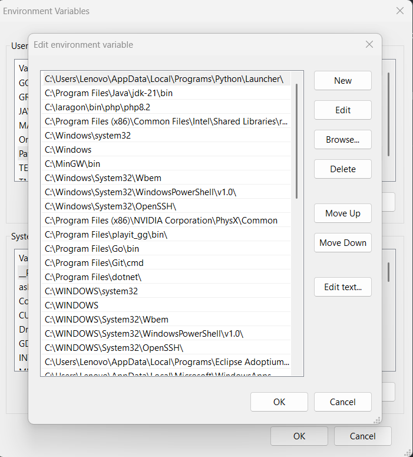

# SETUP ENVIRONMENT DASAR (WAJIB)

Panduan ini hanya fokus ke instalasi tools utama.
Pastikan SEMUA anggota install ini sebelum mulai coding.

---

## 1. GIT (WAJIB)

### Install:
https://git-scm.com/downloads

### Cek:
```bash
git --version
```

## 2. DOCKER (WAJIB)

Install:

https://www.docker.com/products/docker-desktop/

### Cek:
```bash
docker --version
docker-compose --version
```

## 3. GOLANG (BACKEND)

### Install:

https://go.dev/dl/

### Versi minimal:

`Go 1.22+`

### Cek:
```bash
go version

Set GOPATH (opsional tapi bagus)

go env -w GOPATH=$HOME/go
```

## 4. PYTHON (AI SERVICE)

### Install:

https://www.python.org/downloads/

### Versi:

`Python 3.10+`

### Cek:
```bash
python --version
pip --version
```


## 5. NODE.JS (WEB)

### Install:

https://nodejs.org/

### Versi:

`Node 18+`

### Cek:
```bash
node -v
npm -v
```

## 6. POSTGRESQL (DATABASE)

### Install:

https://www.postgresql.org/download/

### Versi:

`PostgreSQL 14+`

### Setelah install:
	•	Username: postgres
	•	Password: bebas (ingat!)

### Cek:
```bash
psql --version

Masuk ke DB:

psql -U postgres
```


## 7. REDIS (CACHE)

#### Windows:

https://github.com/microsoftarchive/redis/releases

#### Mac:

```bash
brew install redis
```

#### Linux:

```bash
sudo apt install redis-server
```

### Cek:

```bash
redis-server
```

## 8. FLUTTER (MOBILE)

### Install:

https://docs.flutter.dev/get-started/install

### Cek:
```
flutter doctor
```

### Install Android Studio:
https://developer.android.com/studio/install?hl=id

### Pastikan:

- ✔ Android toolchain OK

- ✔ Device / emulator ready


## 9. JDK (UNTUK ANDROID)

### Install:

https://adoptium.net/

### Versi:

`JDK 17` (recommended)

### Cek:
```bash
java -version
```


## 10. ANDROID STUDIO

Install:

https://developer.android.com/studio

Wajib:
- Android SDK
- Emulator
- SDK Tools

## 11. REKOMENDASI IDE

### Backend:
- `VSCode / GoLand / Antigravity`

### AI:
- `VSCode / PyCharm / Antigravity`

### Mobile:
- `Android Studio / VSCode / Antigravity`

## 12. VERIFIKASI FINAL (WAJIB)

Semua ini harus jalan:
```bash
git --version

docker --version

go version

python --version

node -v

psql --version

flutter doctor

java -version
```

## TROUBLESHOOTING

PATH error

Tambahkan ke environment variable:
- Go → /usr/local/go/bin
- Node → otomatis
- Python → centang “Add to PATH”



`pathnya harus terdaftar di environment variable semua`
## DONE
